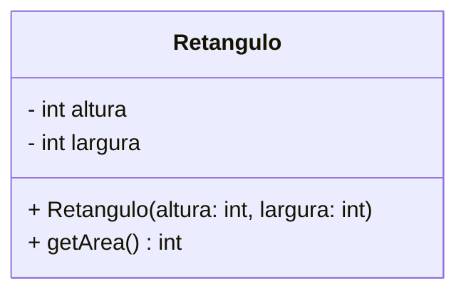
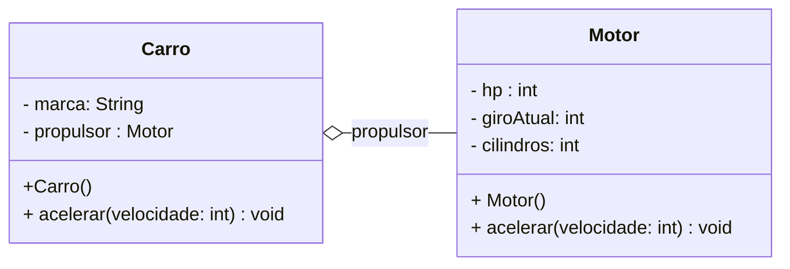

# *Associação de Classes* - Primeira Aula

## *Codigo em Java*

```java
public class Pessoa {
    private String nome;
}
```

## *Diagrama UML - Mermaid*


```mermaid
classDiagram
    class Retangulo {
        - int altura
        - int largura
        + Retangulo(altura: int, largura: int)
        + getArea() int
    }

```

## Associação Carro x Motor


```mermaid
classDiagram
    direction LR
    class Carro {
        - marca: String
        - propulsor : Motor
        +Carro()
        + acelerar(velocidade: int) void
    }
        
    class Motor {
        - hp : int
        - giroAtual: int
        - cilindros: int
        + Motor()
        + acelerar(velocidade: int) void
    }
    Carro o-- Motor : propulsor
```


