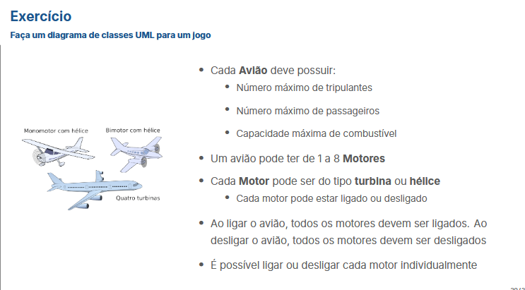
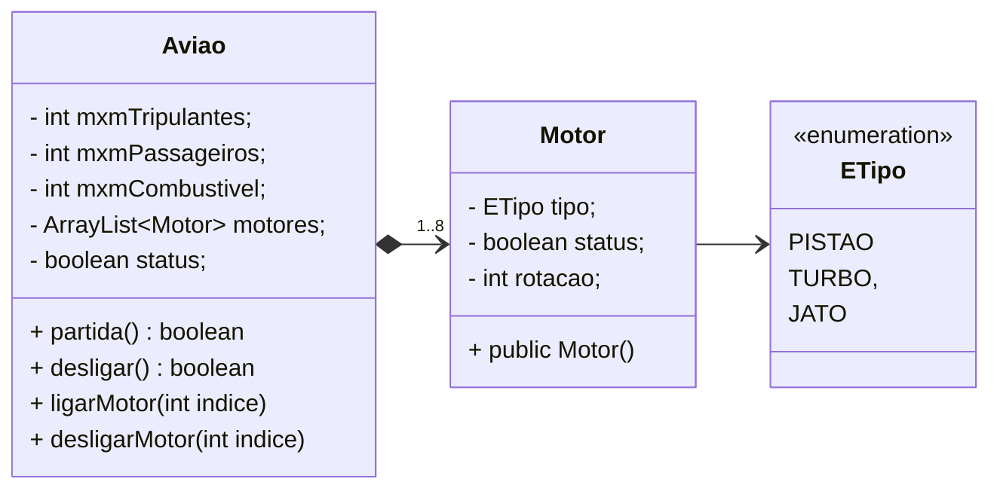

## Exercicio Aula - 29/09/2026

### Diagrama de Classe Avião compôe Motor

```mermaid
classDiagram 
    direction LR
    class Aviao {
        - int mxmTripulantes;
        - int mxmPassageiros;
        - int mxmCombustivel;
        - ArrayList~Motor~ motores;
        - boolean status;
        + partida() boolean
        + desligar() boolean
        + ligarMotor(int indice)
        + desligarMotor(int indice)
    }
    
    class Motor {
        - ETipo tipo;
        - boolean status;
        - int rotacao; 
        + public Motor()
    }
    
    class ETipo {
        <<enumeration>>
        PISTAO 
        TURBO,
        JATO
    }
    Aviao *-->"1..8" Motor
    Motor --> ETipo
    
```