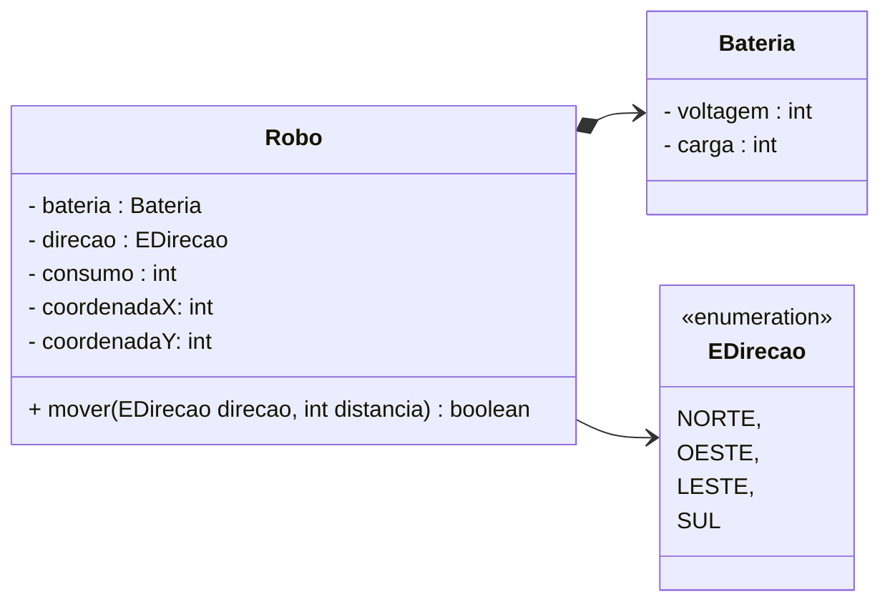

## Exercicio Robô

```mermaid

classDiagram
    direction LR
    class Robo {
        - bateria : Bateria
        - direcao : EDirecao
        - consumo : int
        - coordenadaX: int
        - coordenadaY: int 
        + mover(EDirecao direcao, int distancia) boolean
    }
    
    class EDirecao {
        <<enumeration>>
        NORTE,
        OESTE,
        LESTE,
        SUL
    }
    
    class Bateria {
        - voltagem : int 
        - carga : int 
    }
    
    Robo *-->Bateria
    Robo --> EDirecao
    

```

### [Link das classes desenvolvidas](app/src/main/java/ads/poo)