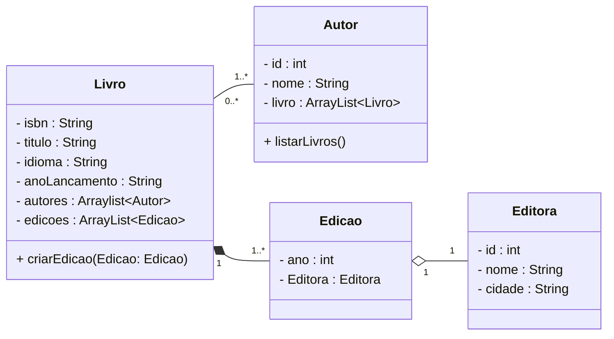
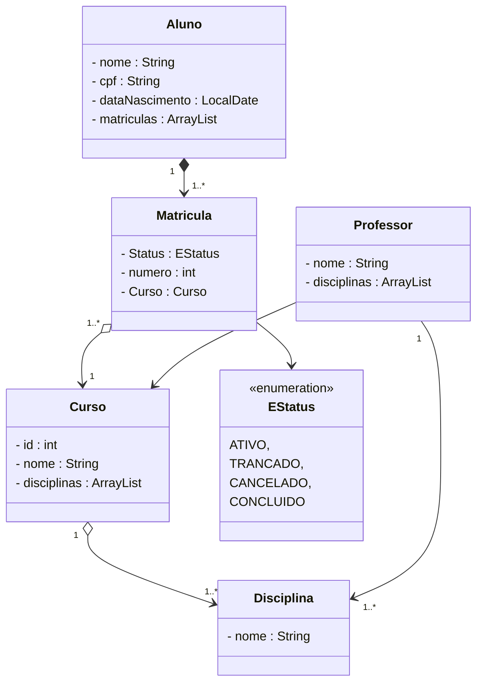
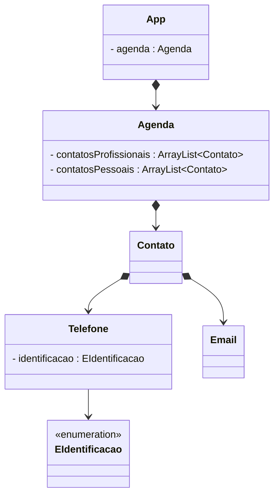

# Exercício elaboração de diagramas de classes

## Diagrama de Classe - Sistema de Livros

```mermaid
classDiagram
    direction LR
    class Autor {
        - id : int
        - nome : String
        - livro : ArrayList~Livro~
        + listarLivros()
    }
    
    class Editora {
        - id : int 
        - nome : String
        - cidade : String
    }
    
    class Livro {
        - isbn : String 
        - titulo : String
        - idioma : String
        - anoLancamento : String
        - autores : Arraylist~Autor~
        - edicoes : ArrayList~Edicao~
        + criarEdicao(Edicao: Edicao)
    }
    
    class Edicao {
        - ano : int
        - Editora : Editora
    }

    Livro "0..*" -- "1..*" Autor
    Livro "1" *-- "1..*" Edicao
    Edicao "1" o-- "1" Editora
```

## Diagrama de Classe - Sistema Acadêmico

```mermaid
classDiagram
    direction TD
    class Curso {
        - id : int
        - nome : String
        - disciplinas : ArrayList<Disciplina>
    }
    
    class Matricula {
        - Status : EStatus
        - numero : int
        - Curso : Curso
    }
    
    class EStatus {
        <<enumeration>>
        ATIVO,
        TRANCADO,
        CANCELADO,
        CONCLUIDO
    }
    
    class Disciplina {
        - nome : String
    }
    
    class Professor {
        - nome : String
        - disciplinas : ArrayList<Disciplina>
    }
        
    
    class Aluno {
        - nome : String
        - cpf : String
        - dataNascimento : LocalDate
        - matriculas : ArrayList<Matricula>
    }
    Curso "1" o-->"1..*" Disciplina
    Matricula --> EStatus
    Matricula "1..*" o-->"1" Curso
    Aluno "1" *--> "1..*" Matricula
    Professor "1" --> "1..*" Disciplina
    Professor --> Curso
```

## Diagrama de Classe - Sistema de Agenda Telefônica

```mermaid
classDiagram
    
    class EIdentificacao {
        <<enumeration>>
    }
    class Telefone {
        - identificacao : EIdentificacao
    }
    
    class Email {
        
    }
    
    class Contato {
        
    }
    
    class Agenda {
      - contatosProfissionais : ArrayList~Contato~
      - contatosPessoais : ArrayList~Contato~
    }
    
    class App {
        - agenda : Agenda
    }
    App *--> Agenda
    Agenda *--> Contato
    Contato *--> Email
    Contato *--> Telefone
    Telefone --> EIdentificacao
```