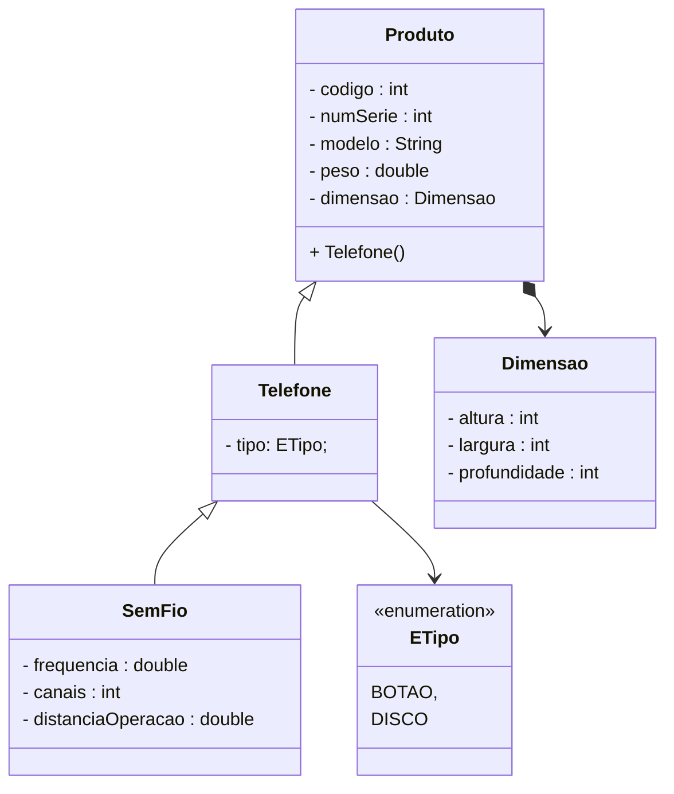

## Diagrama de classe - PRODUTOS

```mermaid
classDiagram
    class Produto {
        - codigo : int
        - numSerie : int
        - modelo : String
        - peso : double
        - dimensao : Dimensao
        + Telefone()
    }
    
    class Telefone {
        - tipo: ETipo;
    }
    
    class SemFio {
        - frequencia : double
        - canais : int
        - distanciaOperacao : double
    }
    
    class Dimensao {
        - altura : int
        - largura : int
        - profundidade : int
    }
    
    class ETipo{
        <<enumeration>>
        BOTAO,
        DISCO
    }
        
    
    Produto *--> Dimensao
    Produto <|-- Telefone
    Telefone <|-- SemFio
    Telefone --> ETipo
```
