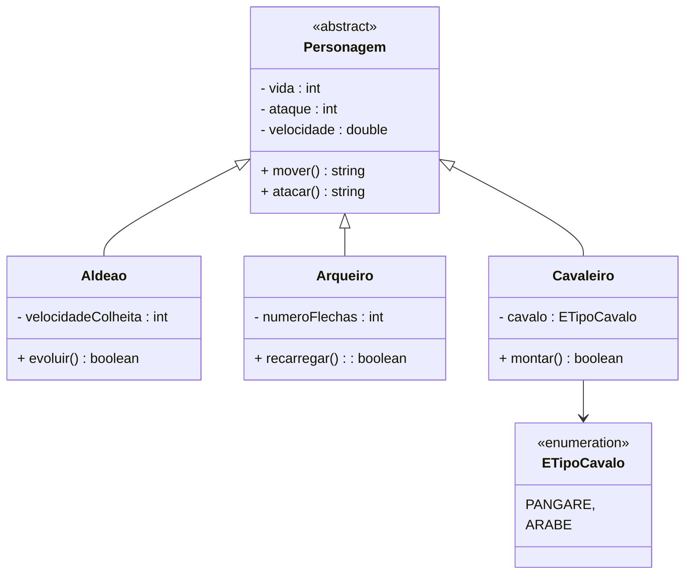

# Jogo Java of Empires

## Diagrama de Classe 

```mermaid
classDiagram
    class Personagem{
        <<abstract>>
        - vida : int
        - ataque : int
        - velocidade : double
        + mover() string
        + atacar() string
    }
    
    class Aldeao {
        - velocidadeColheita : int
        + evoluir() boolean
    }
    
    class Arqueiro {
        - numeroFlechas : int
        + recarregar() : boolean
    }
    
    class Cavaleiro {
        - cavalo : ETipoCavalo
        + montar() boolean
    }
    
    class ETipoCavalo {
        <<enumeration>>
        PANGARE,
        ARABE
    }
    
    Personagem <|-- Aldeao
    Personagem <|-- Arqueiro
    Personagem <|-- Cavaleiro
    Cavaleiro --> ETipoCavalo
    

```