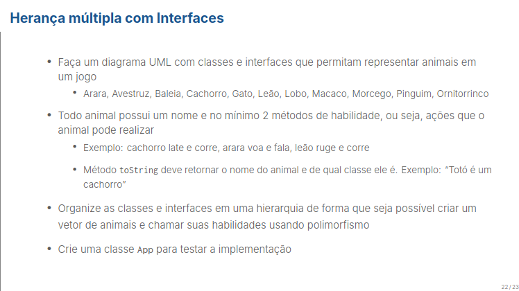
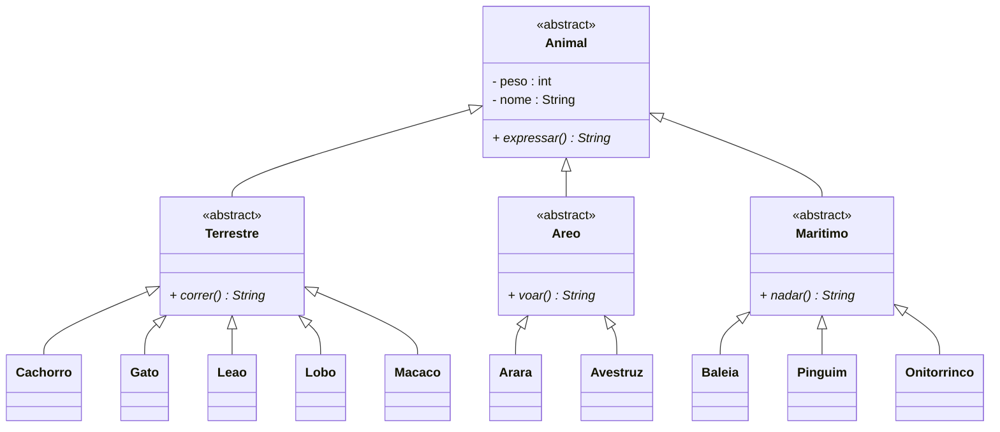

# Exercicio Herança Múltipla com Interfaces

```mermaid
classDiagram
    class Animal {
        <<abstract>>
        - peso : int
        - nome : String
        + expressar() String*
    }
    
    class Terrestre {
        <<abstract>>
        + correr () String*
    }
    
    class Maritimo {
        <<abstract>>
        + nadar () String*
    }
    
    class Areo {
        <<abstract>>
        + voar () String*
    }
    
    Animal <|-- Terrestre
    Animal <|-- Areo
    Animal <|-- Maritimo
    
    Terrestre <|-- Cachorro
    Terrestre <|-- Gato
    Terrestre <|-- Leao
    Terrestre <|-- Lobo
    Terrestre <|-- Macaco
    
    Maritimo <|-- Baleia
    Maritimo <|-- Pinguim
    Maritimo <|-- Onitorrinco
    
    Areo <|-- Arara
    Areo <|-- Avestruz
    
        

```