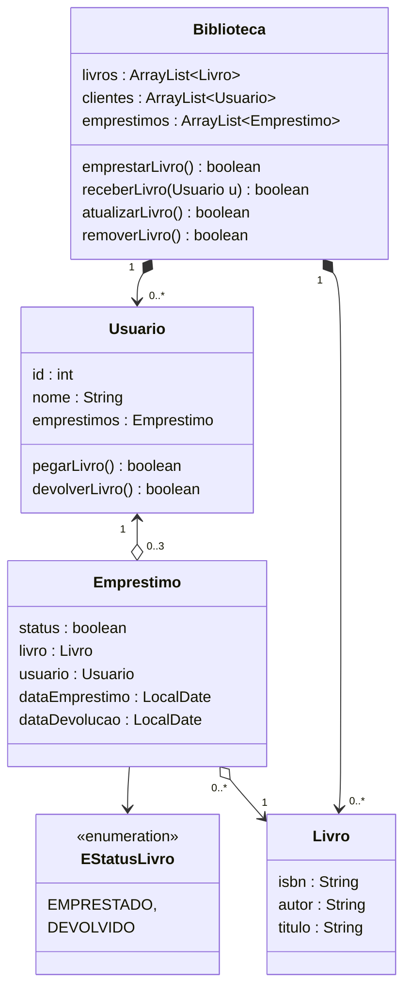
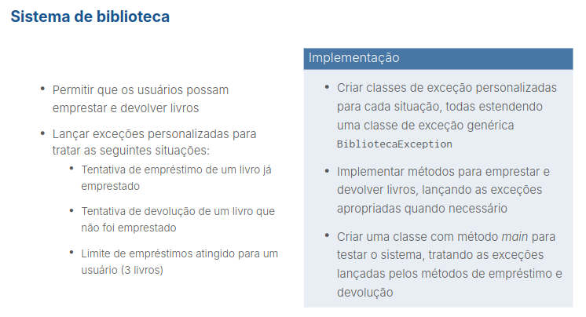

# Sistema de Biblioteca

## Diagrama de classes

```mermaid
classDiagram 
    class Livro {
        isbn : String
        autor : String
        titulo : String
    }
    
    class Usuario {
        id : int
        nome : String
        emprestimos : Emprestimo
        pegarLivro() boolean
        devolverLivro() boolean
    }
    
    class Emprestimo {
        status : boolean
        livro : Livro
        usuario : Usuario
        dataEmprestimo : LocalDate
        dataDevolucao : LocalDate
    }
    
    class Biblioteca {
        livros : ArrayList~Livro~
        clientes : ArrayList~Usuario~
        emprestimos : ArrayList~Emprestimo~
        
        emprestarLivro() boolean
        receberLivro(Usuario u) boolean
        atualizarLivro() boolean
        removerLivro() boolean
    }
    
    class EStatusLivro{
        <<enumeration>>
        EMPRESTADO,
        DEVOLVIDO
    }
        
    Usuario "1" <--o "0..3" Emprestimo
    Emprestimo --> EStatusLivro
    Emprestimo "0..*" o--> "1" Livro
    Biblioteca "1" *--> "0..*" Usuario
    Biblioteca "1" *--> "0..*" Livro
```

## Exercicio:

