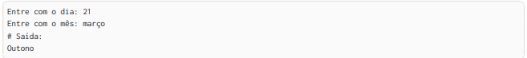

# Estação do ano 

> Faça um programa que leia do teclado um número inteiro que representa o dia, e uma string que representa o mês. 
>>Por fim, imprima na tela a estação do ano correspondente aqui no Brasil.

## Exemplo de Saída

**Soluções:** 
- [Solução 1](app/src/main/java/ads/poo/App.java)
- [Solução 2 com Operador Ternário](app/src/main/java/ads/poo/ResolucaoMelhorada.java)