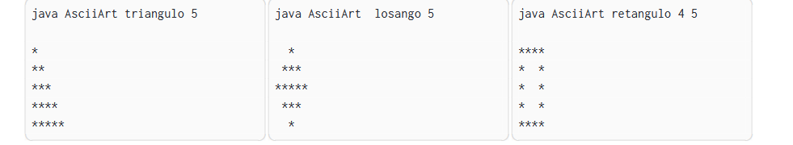

# ASCII Art

> Desenvolva um aplicativo Java que imprima tela, como ASCII art, um triângulo retângulo,
um losango ou um retângulo vazado. 
>> O tipo de figura, bem como sua dimensão, a ser impressa é
escolhido pelo usuário como argumentos de linha de comando.
>>> Caso o usuário forneça argumentos
inválidos, o programa deve informar a forma correta de uso.
>>>>**Exemplos de uso:**

**Solução:** [Exercício 3](app/src/main/java/ads/poo/App.java)