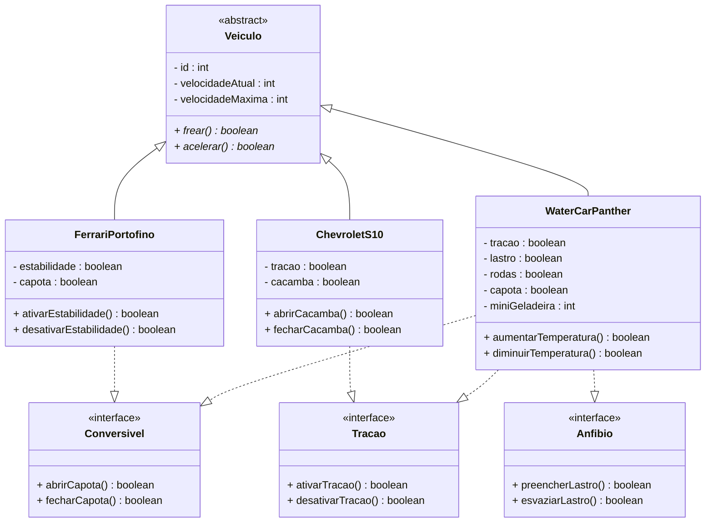

# Lab 06 - Jogo de Veículos.

```mermaid
classDiagram
    class Veiculo {
        <<abstract>>
        - id : int
        - velocidadeAtual : int
        - velocidadeMaxima : int
        + frear() boolean*
        + acelerar() boolean*
    }
    
    class Anfibio {
        <<interface>>
        + preencherLastro() boolean
        + esvaziarLastro() boolean
    }
    
    class Conversivel {
        <<interface>>
        + abrirCapota() boolean
        + fecharCapota() boolean
    }
    
    class Tracao {
        <<interface>>
        + ativarTracao() boolean
        + desativarTracao() boolean
    }
    
    class FerrariPortofino {
        - estabilidade : boolean
        - capota : boolean
        + ativarEstabilidade () boolean
        + desativarEstabilidade () boolean
    }
    
    class ChevroletS10 {
        - tracao : boolean
        - cacamba : boolean
        + abrirCacamba() boolean
        + fecharCacamba() boolean
    }
    
    class WaterCarPanther {
        - tracao : boolean
        - lastro : boolean
        - rodas : boolean
        - capota : boolean
        - miniGeladeira : int
        + aumentarTemperatura() boolean
        + diminuirTemperatura() boolean
    }
    
    Veiculo <|-- FerrariPortofino
    Veiculo <|-- ChevroletS10
    Veiculo <|-- WaterCarPanther
    
    FerrariPortofino ..|> Conversivel
    
    ChevroletS10 ..|> Tracao
    
    WaterCarPanther ..|> Anfibio
    WaterCarPanther ..|> Conversivel
    WaterCarPanther ..|> Tracao

```